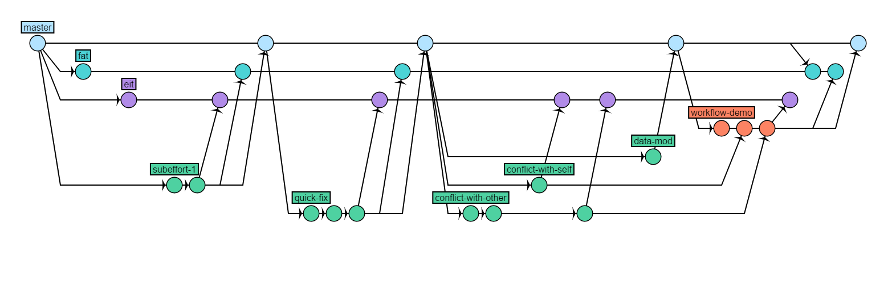

# orakle-git-workflow
> A project to demonstrate the most common workflow for Oracle developers and highlight common pitfalls

<hr>

## Table of Contents

* [Purpose](#purpose)
* [Getting Started](#getting-started)
* [Workflow](#workflow)
  * [Code Changes](#code-changes)
  * [Deploy to EIT](#deploy-eit)
    * [Merge Conflict with Yourself](#merge-conflic-self)
    * [Merge Conflict with Someone Else](#merge-conflic-other)
  * [Deploy to FAT](#deploy-eit)
    * [Master is Ahead of EIT and FAT](#master-out-of-sync)
  * [Deploy to PROD](#deploy-eit)
* [Things to Remember](#remember)


## <a name="purpose"></a>Purpose
The purpose of this project is to provide an interactive training tutorial for Oracle developers to work through and become familar with the Oracle Git Workflow.  The goal is to demonstrate a tyical developer workflow while addressing common pitfalls that might occur. 

## <a name="getting-started"></a>Getting Started
To begin this project, you neeed to Fork this repository to your personal workspace:

1. Click *Fork* in the sidebar
<insert image>
2. Choose your own profile (should be selected by default) from the Project list
4. Click *Fork repository*

Once the repository has been Forked, Clone the repository to your desktop.

1. Click *Clone* in the sidebar
<insert image>
2. Make sure *SSH* is selected in the dropdown
3. Copy the URL to your clipboard
4. Launch *Git Bash*
```bash
git clone <URL>
```

## <a name="workflow"></a>Workflow
This workflow will simulate adding a new feature to an existing Oracle project. In this exercise, you are going to do the following:

1. Modify an existing table
2. Modify an existing package
3. Resolve merge conflicts
4. Sync master with eit/fat
5. Deploy your changes up the stack

### <a name="code-changes"></a>Code Changes
The first thing you need to do when you begin any Oracle project, is create a branch from master.  This can be done from your local repository or from Bitbucket.  However, it is recommended to create a branch from Bitbucket because it minimizes the risk of getting your branch out of sync with master.

1. Click *Create branch* from the sidebar
<insert image>
2. Select *Custom* from the *Branch type* dropdown
3. Select *master* from the *Branch from* dropdown
4. Enter *SUBEFFORT-4* for your *Branch name*

Once you have created a branch in Bitbucket, pull it down to your local repository:

1. Launch *Git Bash*
2. Sync with Bitbucket and create a local branch to track our remote branch:
```bash
git fetch
git checkout SUBEFFORT-4
```

Now that we are in a new branch lets make some code changes. Modify the following files files accordingly:

./tables/table_2
```sql
CREATE TABLE table_2
(
  column_1 varchar2(32) NOT NULL,
  column_2 varchar2(32) NOT NULL,
  column_3 varchar2(32) NOT NULL,
  column_4 varchar2(32) NOT NULL,
);
```
./schema_pre_deployment/subeffort-4-table_2.sql
```sql
ALTER TABLE table_2 ADD (
  column_3 varchar2(32),
  column_4 varchar2(32),
);
```

It is recommended to commit to your local respository frequently. To save your work:
```bash
git add --all
git commit -m "<Insert a meaningful commit message>"
```

Once you have saved your work, you can move on to the next task. Modify the following files files accordingly:

./packages/package_1.sql
```sql
CREATE OR REPLACE PACKAGE package_1
  PROCEDURE procedure_1;
  PROCEDURE procedure_2;
  PROCEDURE procedure_3;
END package_1;
/
```
./packagebodies/package_1.sql
```sql
CREATE OR REPLACE PACKAGE BODY package_1 AS

  PROCEDURE procedure_1
  IS
    p1 VARCHAR2 (32) := 'Hello procedure_1';
  BEGIN
    DBMS_OUTPUT.put_line (p1);
  END procedure_1;

  PROCEDURE procedure_2
  IS
    p2 VARCHAR2 (32) := 'Hello procedure_2';
  BEGIN
    DBMS_OUTPUT.put_line (p2);
  END procedure_2;

  PROCEDURE procedure_3
  IS
    p3 VARCHAR2 (32) := 'Hello procedure_3';
  BEGIN
    DBMS_OUTPUT.put_line (p3);
  END procedure_3;

END package_1;
/
begin
  package_1.procedure_1;
  package_1.procedure_2;
  package_1.procedure_3;
end;

/
```

Commit the changes to your local respository:
```bash
git add --all
git commit -m "<Insert a meaningful commit message>"
```

### <a name="deploy-eit"></a>Deploy to EIT
Once you have fully implemented and tested your changes, it is time to deploy to the EIT environment.  To begin, push your changes from your local repository to Bitbucket:
```bash
git push origin SUBEFFORT-4
```

Once your code has been pushed to Bitbucket, create a Pull Request from your branch to the EIT branch:

1. Click *Create pull request* in the sidebar
2. Select *SUBEFFORT-4* from the *Source branch* dropdown
3. Select *eit* from the *Destination branch* dropdown
4. Click *Continue*
5. Enter a name for the pull request
> Putting your JIRA release task in the title will automagically link them
6. Add a reviewer
> Not neccessary for this tutorial
7. Click *Create*
8. Inspect your pull request to ensure everything is correct

Next, create a JIRA Release Task referencing your Pull Request for deployment.
> Not necessary for this tutorial

#### <a name="merge-conflic-self"></a>Merge Conflict with Yourself
Once you have created your Pull Request, Bitbucket will inform you of several issues. We have a couple of merge conflicts that we need to resolve.

Let's fix the merge conflict in 'tables/table_2.sql' first:
If you click *Blame* in the top right corner of the screen and scroll down to the area in conflict, you will see that the conflict is with ourself.
> The conflict is actually with Chris Weeks but play along, please.

Follow these steps to resolve the conflict:

1. Copy the hash of the commit the commit that is causing the conflict
2. Launch *Git Bash*
3. Sync with Bitbucket and checkout our local branch
```bash
git fetch
git checkout SUBEFFORT-4
```
> We should be synced up and on the right branch already, but just in case
4. Merge the conflicting code into our branch
```bash
git merge <hash>
```
> Notice how git fails to automatically merge. This is because both commits have been modified in the same place. Typing `git status` will give us some more information.
5. Resolve the conflict by editing the following file:
./tables/table_2
```sql
CREATE TABLE table_2
(
  column_1 varchar2(32) NOT NULL,
  column_2 varchar2(32) NOT NULL,
  column_3 varchar2(32) NOT NULL,
  column_4 varchar2(32) NOT NULL,
);
```
> We can simply copy and paste what we intended to be in the file in the first place. This is because the merge conflict is with ourselves. Sometimes it is not always so simple. Exercise common sense when fixing merge conflicts.
6. Mark the file as resolved:
```bash
git add ./tables/table_2
```
7. Finish the merge by creating a commit:
```bash
git commit -m "Resolved merge conflict in table_2"
```
8. Push your changes back up to Bitbucket:
```bash
git push origin SUBEFFORT-4
```
> Notice how Bitbucket will automagically reflect the changes in your Pull Request

#### <a name="merge-conflic-other"></a>Merge Conflict with Someone Else
We still have another issue. If you look at './packagebodies/package_1.sql' you will notice
that it has a merge conflict as well.

If we repeat the step above and click Blame, you will notice that this time the conflict is caused by another developer. To resolve a merge conflict with someone else, you must work with the conflicting developer.  The only way to resolve this type of 
conflict is to integrate their changes into your own code.  The emphasis here is that you and the conflicting developer need to coordinate and decide on the appropriate path forward together.  It is possible that you both will have to work together and 
deploy together in order to have a successful release. 


To resolve a merge conflict with someone else:
> The steps to resolving a merge conflict with someone else is technically identical to the steps required to resolve a merge conflict with yourself; however, it is crucial to work with the conflicting developer prior to taking any steps toward resolution.

1. Copy the hash of the commit the commit that is causing the conflict
2. Launch *Git Bash*
3. Sync with Bitbucket and checkout our local branch
```bash
git fetch
git checkout SUBEFFORT-4
```
> We should be synced up and on the right branch already, but just in case
4. Merge the conflicting code into our branch
```bash
git merge <hash>
```
> Notice how git fails to automatically merge. This is because both commits have been modified in the same place. Typing `git status` will give us some more information.
5. Resolve the conflict by editing the following file:
./packagebodies/package_1
```sql
CREATE OR REPLACE PACKAGE BODY package_1 AS

  PROCEDURE procedure_1
  IS
    p1 VARCHAR2 (32) := 'Hello procedure_1';
  BEGIN
    DBMS_OUTPUT.put_line (p1);
  END procedure_1;

  PROCEDURE procedure_2
  IS
    p2 VARCHAR2 (32) := 'Hello procedure_2';
  BEGIN
    DBMS_OUTPUT.put_line (p2);
  END procedure_2;

  PROCEDURE procedure_3 (num IN NUMBER)
  IS
    p3 VARCHAR2 (32) := 'Hello procedure_3';
  BEGIN
    DBMS_OUTPUT.put_line (num);
    DBMS_OUTPUT.put_line (p3);
  END procedure_3;

END package_1;
/
begin
  package_1.procedure_1;
  package_1.procedure_2;
  package_1.procedure_3;
end;

/
```
> In this scenario we decided to go with both developers code. This means that you will have to coordinate all future deployments together. 
6. Mark the file as resolved:
```bash
git add ./packagebodies/package_1
```
7. Finish the merge by creating a commit:
```bash
git commit -m "Resolved merge conflict in package_1"
```
8. Push your changes back up to Bitbucket:
```bash
git push origin SUBEFFORT-4
```
> Notice how Bitbucket will automagically reflect the changes in your Pull Request

Now that the conflicts have been resolved, your code is ready to be merged to EIT.  At this point in the process, the RM Team would merge and deploy your code.
> For this exercise, the RM Team is not involved so proceed by clicking Merge.

### <a name="deploy-fat"></a>Deploy to FAT
Now that you have successfully deployed to EIT, you are ready to deploy to the FAT environment. Like you did previously, create a Pull Request. This time we will be creating the Pull Request from SUBEFFORT-4 to the FAT branch.

Next, update your existing JIRA Release Task with your new Pull Request.
> Not necessary for this tutorial

#### <a name="master-out-of-sync"></a>Master is Ahead of EIT and FAT
Once you have created your Pull Request you will notice that there is a new issue.  Someone else's files have made it into your Pull Request.  This means that someone has merged code to master without merging to EIT and FAT branches first; thus, master is ahead of EIT and FAT.
> Note that Bitbucket doesn't warn us of this issue. This is one of the reasons why you should always inspect your Pull Request

To resolve this issue
1. Create a Pull Request from the master branch to the FAT branch
2. In the description field enter the following text:
```
\*\*\*Syncing fat with master. Please merge and do not deploy\*\*\*
```
3. You will need to notify the RM Team to merge your code via email because you will not have a JIRA task for this change.
> Not necessary for this tutorial

Once the Pull Request has been merged to FAT (you will have to merge it), notice that the issue has beeen resolved.

The RM Team would now merge and deploy your code.
> Remember, for this exericse, the RM Team is not involved.  Proceed by clicking Merge.

### <a name="deploy-prod"></a>Deploy to PROD
Once your code has been deployed and tested in the FAT environment, you are ready to stage your changes for PROD.

Just like you did in EIT and FAT, create a Pull Request from your branch to the master branch.

Next, update your existing JIRA Release Task with your new Pull Request.
> Not necessary for this tutorial

The RM Team would now merge and deploy your code in the Standard Release Cycle.
> Remember, the RM Team is not involved. Click Merge and celebrate.

## <a name="remember"></a>Things to Remember
* Always create your branches from the master branch.
* Thoroughly review your Pull Requests.
* Use common sense and communication to resolve merge conflicts.
* If MASTER gets ahead of EIT and/or FAT, Pull Request MASTER into EIT and/or FAT to resolve.
* Never merge EIT or FAT into your branches.

